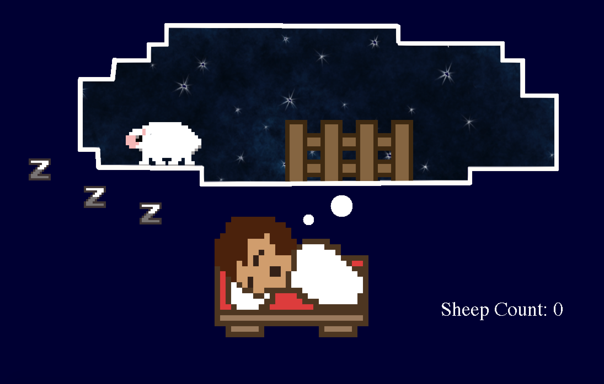
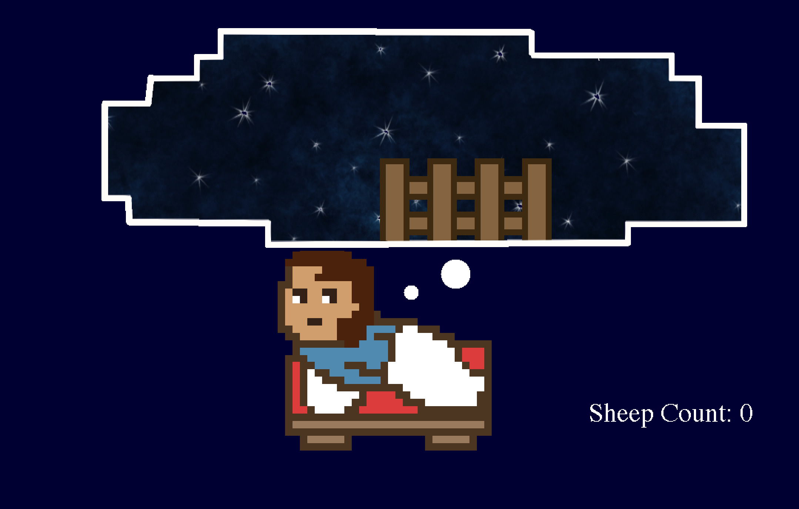

# Counting Sheep Sprite Animation
This is my final project for our Year 11 MYP CS course.  

### Description
The idea was to create a product to fit the user's preferences. My user just stated he wanted a peaceful animation, so I took a creative twist to it, and made a "Counting Sheep" animation. I took the chance to learn animating with Sprites in Java, as well as looking into UI/UX functionalities. 

### Screenshots
Default Screen:

Awake Screen - Activated by Mouse Movement

Sheep counter updates when one sheep crosses the dream bubble boundary:

Sheep Movement - Follows a parabolic motion. Sprite sheet is created with Piskel.

Human Movement - Sprite Sheets - created with Piskel:

### Credits
The main bulk of my algorithim is inspired by the tutorial provided in https://sites.google.com/site/javagamescorner/home. All credits are for the double buffer algorithm goes to them. 
